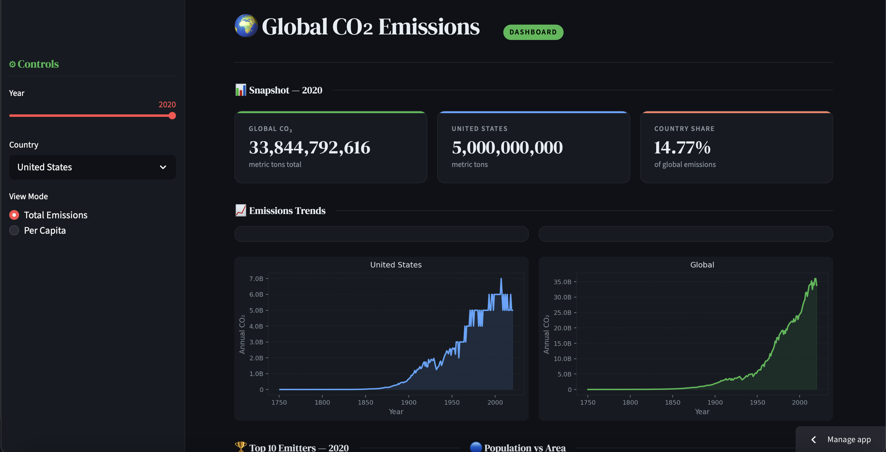
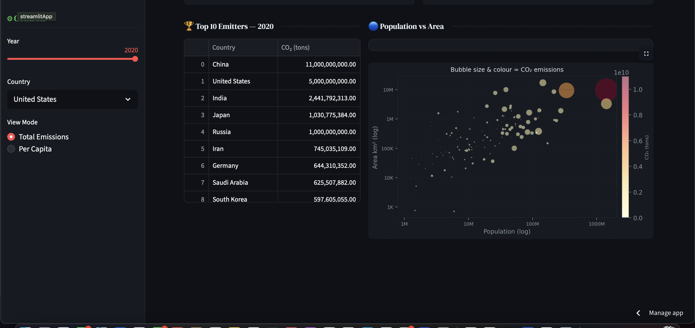

# Global CO₂ Emissions Analyzer

An interactive data science project exploring historical and modern carbon emissions across countries. This project combines data cleaning, time-series analysis, statistical visualization, and an interactive Streamlit dashboard to examine global emission patterns.

---

## Live Dashboard

View the live app: https://co2-emissions-analyzer.streamlit.app

---

## Dashboard Preview

### Main Dashboard




### Top Emitters


### Population vs Area Bubble Chart


---

## Project Objectives

This project aims to:

* Analyze global CO₂ emission trends over time
* Compare countries by total and per-capita emissions
* Explore relationships between emissions and country characteristics
* Build an interactive dashboard for exploratory analysis
* Demonstrate an end-to-end data science workflow

---

## Dataset

The dataset contains country-level CO₂ emissions with fields such as:

* Country
* Year
* CO₂ emission (tons)
* Population (2022)
* Area (km²)
* Density
* Percent of world landmass

Note: The raw emissions were cumulative. Annual emissions were derived using year-to-year differencing.

---

## Data Processing Pipeline

Key preprocessing steps:

* Renamed columns to consistent snake_case
* Fixed encoding issues
* Converted percentage and density fields to numeric
* Removed duplicate country-year records
* Derived annual CO₂ emissions from cumulative totals
* Computed CO₂ per capita
* Filtered extreme outliers for visualization clarity

---

## Key Analyses and Visualizations

### Historical emissions

* Top cumulative emitters
* Global emissions trend (linear and log scale)

### Per-capita analysis

* Identifies emission intensity by country
* Highlights high per-person emitters

### Correlation heatmap

Explores relationships between emissions, population, area, and density.

### Bubble visualization

* x-axis: population
* y-axis: land area
* bubble size: CO₂ emissions

---

## Interactive Dashboard Features

Built with Streamlit, the dashboard includes:

* Year slider
* Country selector
* Live emission metrics
* Country trend visualization
* Global trend visualization
* Top emitters leaderboard
* Bubble chart
* Total vs per-capita toggle

---

## Tech Stack

Languages and libraries:

* Python
* Pandas
* NumPy
* Matplotlib
* Seaborn
* Streamlit
* Scikit-learn

Concepts demonstrated:

* Data cleaning
* Time-series differencing
* Feature engineering
* Exploratory data analysis
* Statistical visualization
* Interactive app development
* Cloud deployment

---

## How to Run Locally

Clone the repository:

```bash
git clone https://github.com/ap44444/co2-emissions-analyzer.git
cd co2-emissions-analyzer
```

Install dependencies:

```bash
pip install -r requirements.txt
```

Run the dashboard:

```bash
streamlit run dashboard/app.py
```

---

## Key Insights

* Historical emissions are dominated by early industrial economies.
* Modern per-capita emissions highlight fossil-fuel-intensive nations.
* Population alone is only weakly correlated with national emissions.
* Global emissions show a sharp post-1950 acceleration.

---

## Future Improvements

Potential extensions:

* Geospatial world map
* Emissions forecasting model
* Sector-level emissions breakdown
* Plotly interactive charts
* Multi-page Streamlit app

---

## Author

Ananyaa Prabagar
GitHub: https://github.com/ap44444

If you found this project useful, consider starring the repository or connecting.

---

## License

This project is for educational and analytical purposes.
